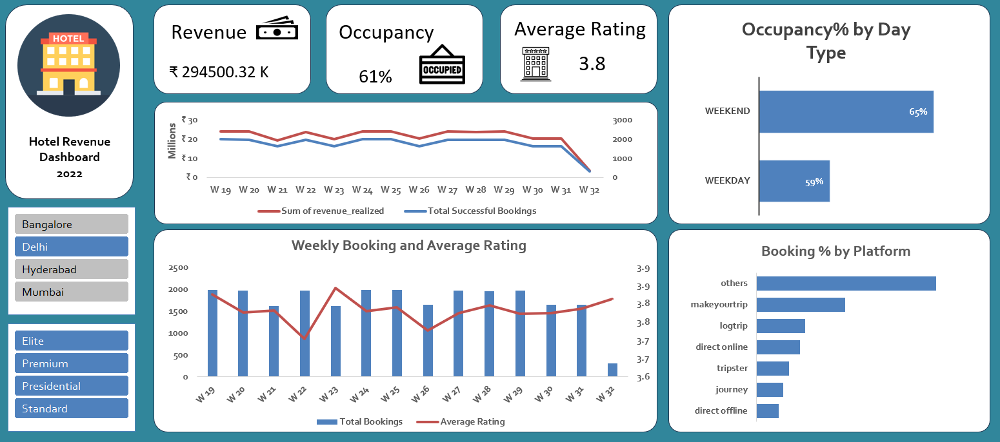
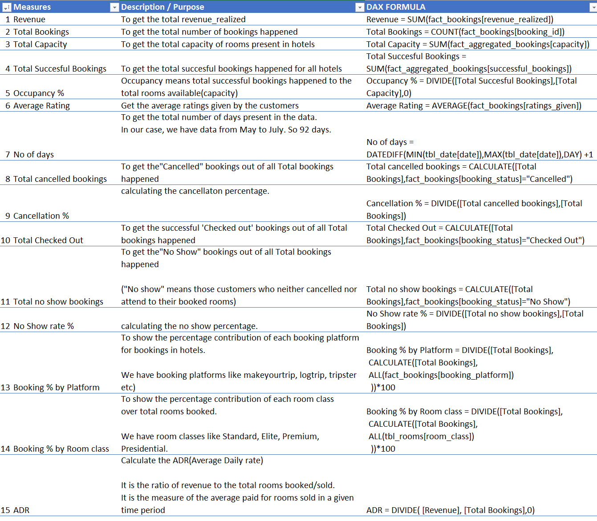

# Hotel Revenue Analysis
Hotel Performance Dashboard

AtliQ Grands owns multiple five-star hotels across India. They have been in the hospitality industry for the past 20 years. Due to strategic moves from other competitors and ineffective decision-making in management, AtliQ Grands are losing its market share and revenue in the luxury/business hotels category. As a strategic move, the managing director of AtliQ Grands wanted to incorporate “Business and Data Intelligence” to regain their market share and revenue. 

### 📊 Download the Excel File

[Download Hotels_1.xlsx](https://github.com/antik720720/Hotel-Revenue-Report/raw/main/Hotels_1.xlsx)
### 📈 Dashboard Preview

Tools used - Power Query, Power pivot, Excel

KPIs used --
## 📌 Key Performance Indicators (KPIs)

The following DAX formulas were used to calculate core metrics for the Hotel Revenue Report:

